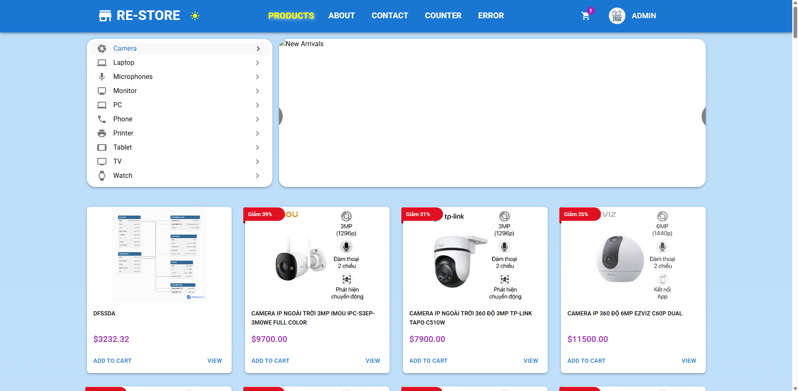
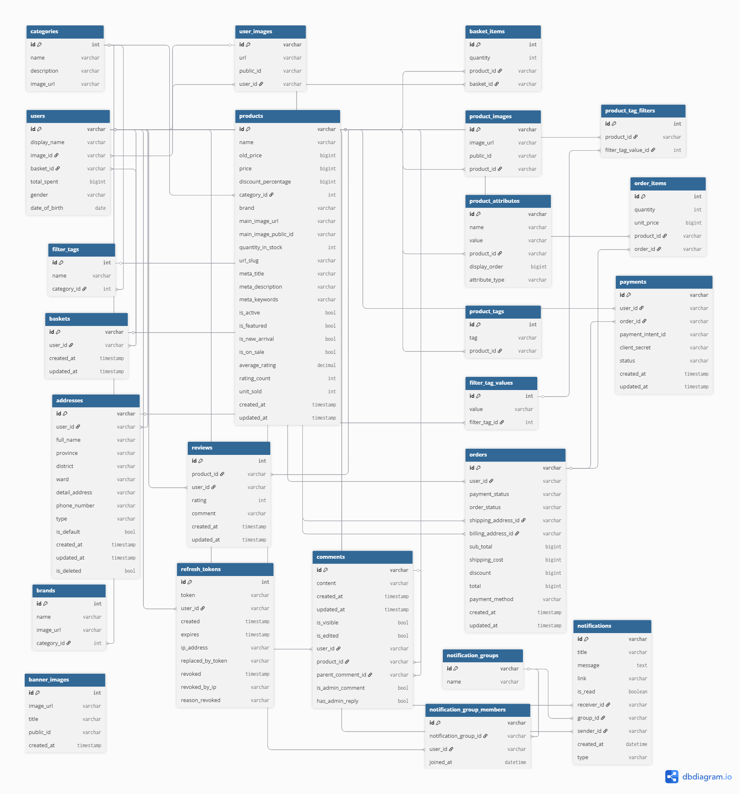

# E-Commerce Store 🛒

An e-commerce website built with _React + Vite_ (frontend) and _ASP.NET Core_ (backend), following the Clean Architecture approach. This project aims to simulate a real-world e-commerce system, showcasing a complete feature set including authentication, admin dashboard, order management, and more.

**[Live Demo](https://e-commerce-store-five-azure.vercel.app/)**

**Account demo:**

- Admin account:
  - Account: admin@gmail.com
  - Password: Pa$$w0rd
- User account:
  - Account: bob@gmail.com
  - Password: Pa$$w0rd

_(for testing realtime comment/review and notification)_



## ► 🛍️ Key Features

### 1. User Management & Authentication

- **Registration & Login** using ASP.NET Core Identity + JWT
- **JWT Access Tokens** & **Refresh Tokens** stored in secure (HttpOnly, SameSite=None, Secure) cookies. Use JWT access token for Authentication and JWT refresh token for refresh access token when it expired. Refresh token also saved in database.
- **Role-Based Authorization** (Admin vs. Customer)
- **Password Reset** & **Email Confirm** & **Forgot Password** workflow with transactional emails (Resend API)

### 2. Product & Category Management

- **Admin CRUD product**: admin can create and update product with full details, inluce name, description, price, discount, attributes,... And admin also can delete product.
- **Analys products, custommers**: admin can view the total products sold, total revenue, top-selling products, top customers,...
- **Rich Media** support: Admin also can upload one or many detail images to Cloudinary per product
- **List & Filter**: Users can get products by category, users can filter them by Filter Tags corresponding with each selected category. E.g: Phone has resolution 5, Chip, RAM,... Laptop has Graphics Card, Hard disk,... Users also can filter product by discount, price, brand,..
- **Product Details**: Each product has its own detail page with full information: price, description, quantity in stock,... This page also has comment, review about this product

### 3. Photos Management

- **Cloudinary Integration**: All uploaded images (e.g., avatars) are stored, optimized, and served via Cloudinary.
- **Banners Manage**: Admin can upload new banners onto Cloudinary server. And admin also remove any banner existed.
- **Product Images**: Admins can update new main image and detail images for each product
- **Avatar** Each user or admin also can upload their own avatar

### 4. Shopping Cart & Checkout

- **Persistent Cart**: per authenticated user
- **Add/Update/Remove**: user can add new or existed product into cart, can remove permanent or reduce the number of products. Users can select/unselect multiple products with only one click per category, or select/unselect all products in cart for preparing for Payment.
- **Order Placement**: users can payment with multiple ways (banking, card, COD,...). In card payment method, users can pay via StripePayment Gateway (Stripe Payment Intent)
- **Order History**: user can tracking orders and payments, and also see detail information for these

### 5. Real-Time Comments & Reviews

- **SignalR Hub** for live comment and review threads on products
- **Nested Comments**: was built intuitively like modern social media platforms like Facebook, Instagram
- **Comment & Review**: users can add new comment, or reply other comments. Users also can add new review, rating for products.

### 6. Real-Time Notifications

- **NotificationHub**: for live notification threads on any review or comment that user input
- **Notification Popup**: contextual popup notifications for user or admin actions (e.g., new comment or review), displayed in real time.
- **Notification Manage**: user/admin can manage notification by mark as read notification, delete notification. Also can sort and filter notifications to easily track and review important updates

### 7. Email Notifications

- **Transactional Emails** for registration, password reset, order confirmation
- Built on **Resend API** for reliable delivery

### 8. Address

- **GHN API** integration for getting Provinces / Districts / Wards
- **CRUD**: users can create new/update/remove addresses. It's used for Order feature. Users can use this feature at Order step or at user's profile

### 9. Validation & Error Handling

- **Client-Side**: Zod schemas + React Hook Form + `@hookform/resolvers/zod`
- Centralized **API Error Wrapper** (`HandleResult`)

### 10. Architecture & Patterns

- **Clean Architecture**: API ↔ Application ↔ Domain ↔ Infrastructure
- **CQRS** with MediatR: separate Commands & Queries
- **Repository Pattern** & **Unit of Work** for data access
- **AutoMapper**: easy for mapping between entity and DTO

### 11. Product Recommendation

- **Generate Product Embedding Vector** Extract vector representations for each product based on attributes such as name, description, price, category, brand, etc.
- **Average of Tracking Product** Track user interactions (e.g., view, add to cart, purchase) and compute a weighted average of the corresponding product vectors using weights (view: 1.0, add to cart: 1.5, purchase: 2.0).
- **Cosine Similarity** Calculate cosine similarity between the user's average vector and all product vectors, and return the top 10 most similar products.

---

## ► 🚀 Tech Stack

### **Backend**

- **Framework:** .NET 9, ASP.NET Core
- **Architecture:** Clean Architecture, CQRS Pattern with MediatR, Repository Pattern
- **Database:** Entity Framework Core, PostgreSQL (hosted on Neon)
- **Authentication:** ASP.NET Core Identity + JWT
- **Real-time:** SignalR
- **Redis** Caching
- **External Services:**
  - **Cloudinary:** Image hosting and optimization
  - **Resend:** Transactional email delivery
  - **Stripe** Payment gateway

### **Frontend**

- **Framework:** ReactJS
- **Language:** TypeScript
- **Build Tool:** Vite
- **State Management:** Redux
- **Query** RTK Query, GraphQL
- **Routing:** React Router
- **UI Library:** Material-UI (MUI)
- **HTTP Client:** Axios

### **Deloyment**

- **Platform:** Fly.io
- **CI/CD:** GitHub Actions – auto-build and deploy on push to the `main` branch
- **Model:** Unified deployment – the ASP.NET Core backend serves both the API and the React frontend (from the `wwwroot` folder)

---

## ► Database Schema

The diagram below illustrates the structure and key relationships between entities in the application's PostgreSQL database.



## ► Getting Started Locally

### **Requirements**

- [.NET 9 SDK](https://dotnet.microsoft.com/download/dotnet/9.0)
- [Node.js](https://nodejs.org/) (v18 or later)
- An account and database on [Neon](https://neon.tech/)
- An account and secret key on [Stripe](https://stripe.com/)
- An API Token for geting address on [GHN](https://api.ghn.vn/home/docs/detail?id=78)
- Accounts for [Cloudinary](https://cloudinary.com/), [Resend](https://resend.com/).
- JWT key for Auth

### **1. Backend Setup**

1.  Clone this repository.
2.  Navigate to the `API` folder.
3.  Create a new file `appsettings.Development.json` in API folder.
4.  Open file `appsettings.Development.json` and fill in the following configuration:

    - `ConnectionStrings:DefaultConnection`: Your Neon database connection string.
    - `CloudinarySettings`: Your Cloudinary API credentials.
    - `Resend:ApiToken`: Your Resend API token.
    - `GHN:ApiToken`: Your GHN API token.
    - `Stripe:Secretkey`: Stripe `Secretkey` for virtual payment.
5. Running Docker and run this command to create container(if container already not existed):
    ```bash
    docker run -d --name redis -p 6379:6379 redis
    ```
    Or start container(if container already existed):
    ```bash
    docker start redis
    ```
6.  Open terminal in folder `API` và run this command to migrations and create the database:
    ```bash
    dotnet ef database update
    ```
7.  Start the backend:
    ```bash
    dotnet watch run
    ```
    Backend will run at `https://localhost:5001` or a similar port.
8.  Auto generate addresses for each user by run endpoint
    ```bash
    POST:
    https://localhost:5001/api/address/create-virtual-addresses
    ```
9.  Auto generate orders for testing analyst(admin feature) by run endpoint
    ```bash
    POST:
    https://localhost:5001/api/order/create-virtual-order
    ```
10.  Auto generate products embedding vectors for using recommanded by run endpoint
    ```bash
    POST:
    https://localhost:5001/api/products/generate_product_vector
    ```

### **2. Frontend Setup**

1.  Open a new terminal and navigate to the `client` folder.
2.  Install dependencies:
    ```bash
    npm install
    ```
3.  Create a `.env.development` file if not exist and add the following:
    ```bash
    # client/.env.development
    VITE_API_URL=https://localhost:5001/api
    VITE_COMMENT_URL=https://localhost:5001/commentHub
    VITE_REVIEW_URL=https://localhost:5001/reviewHub
    VITE_STRIPE_PK=your_stripe_pk
    ```
4.  Start the frontend:
    ```bash
    npm run dev
    ```
    Frontend will run at `http://localhost:3000`.
